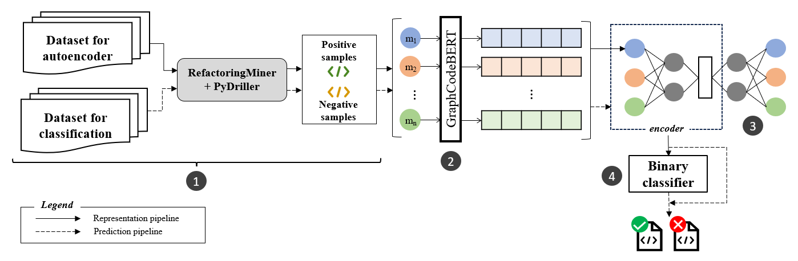

# Automatic Refactoring Candidate Identification Leveraging Effective Code Representation


The use of machine learning to automate the detection of refactoring candidates is a rapidly evolving research area. The majority of work in this direction uses source code
metrics and commit messages to predict refactoring candidates and do not exploit the rich semantics of source code. This paper proposes a new method to predict extract method refactoring
candidates. We employ a self-supervised autoencoder to acquire a compact representation of source code generated by a pre-trained large language model. Subsequently, we train a classifier
to solve the extract method identification task. We evaluate the performance of the proposed approach against a state-of-the-art baseline model; our proposed approach outperforms the
state-of-the-art model by 30% in terms of the F1 score. The proposed work has implications for researchers and practitioners.
Software developers may use the proposed automated approach to predict refactoring candidates better. This study will facilitate the development of improved refactoring candidate identification methods that the researchers in the field will use and extend.

**<div style="text-align: center">Approach Overview</div>**


<!-- <figcaption style='text-align: center'>Fig: Approach Overview</figcaption> -->


## Computational requirements

### Software Requirements
- Windows/Linux
- Python 3.10+
    - joblib
    - PyDriller
    - python-dotenv
    - transformers
    - tensorflow
    - torch
    - scikit-learn

### Memory and Runtime Requirements

Any CUDA based GPU with a **minimum memory of 4GB**.

## Steps to reproduce
(_Note: Provided steps are for linux based system_)

### Dependencies and Environment Set-Up

- Clone this repository to the local folder '`cd`' into the folder.

- _(optional)_ Setup virtual environment 
  ```sh
  python -m venv <venv_name>
  source <venv_name>/bin/activate  
  ```

- Install all the dependencies 
  ```sh
  pip install -r requirements.txt
  ```

- The code is optimized for GPU (cuda) so running it on a GPU with decent memory should work fine. _If there is memory issue, please lower the batch size._*


### Extract Method Dataset Creation

- The file input.csv contains all the repository names from the baseline for which the dataset is to be created. 

- To split the file in 5 parts, execute the following script:
  ```
  source csv-splitter.sh
  ```
    _Note: The split size can be configured from the script._

- We then took 5% of the repositories, from first 2 splits to extract the positive and negative samples. 

- To generate the positive and negative samples, execute the following python script with needed arguments. 
  ```sh
  python data_creator.py <inpute_file_path> <output_file_path>
  ```
  This will create the .jsonl file with the identified samples. 
- **Pre-generated dataset is present in https://doi.org/10.5281/zenodo.8122619**


### Deep Learning

- First navigate to the deep learning folder using - 
  ```sh
  cd deep-learning
  ```

- Splitting the dataset (.jsonl file) to train and test split:

- To split the dataset execute the following python script with needed arguments- 
  ```sh
  python data_creator.py <input_file_path> <output_file_name>
  ```
  It will split the dataset and store it as '`.npy`' files as '`data/np_arrays/output_file_name.npy`'

- To train and test the autoencoder model, execute the following script- 
  ```sh
  python autoencoder_pn.py <train_data_file_path> <test_data_file_path>
  ```
  This will store the validated model in '`./trained_models/AE/models`'

- To train and test the random forest classifier, execute the following python script with 4 arguments- 
  ```sh
  python classify_rf.py <train_data_file_path> <train_label_file_path> <test_data_file_path> <test_label_file_path>
  ```
  It will generate the encoded embeddings on the fly and the final evaluation metrics will be displayed on the terminal. 

- To plot the t-SNE plots, execute execute the following script from the cloned root directory- 
    ```sh
    cd deep-learning/metrics/
    python plot.py tsne <embedded_representation_path> <label_array_path>
    ```
### License
[Apache-2.0](https://github.com/SMART-Dal/extract-method-identification/blob/main/LICENSE)
    
### Citation
```
@software{Palit_Extract_method_identification,
author = {Palit, Indranil and Shetty, Gautam and Arif, Hera and Sharma, Tushar},
license = {Apache-2.0},
title = {{Extract method identification}},
url = {https://github.com/SMART-Dal/extract-method-identification}
}
```
